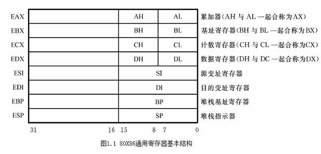
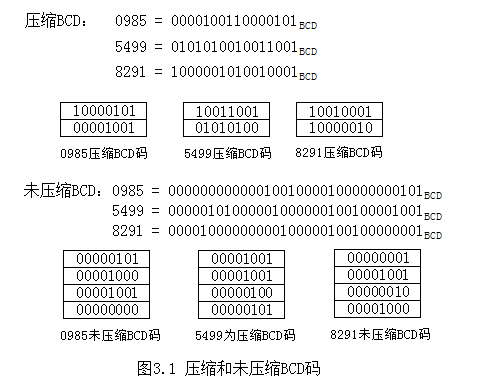

## 第一章习题答案

### <span id='answer1'>第1题答案</span>

*[点击查看题目](./homework.md#homework1 '点击前往')*

1. 此处的汇编明显是一个动作，指的是汇编程序**翻译加工**汇编源程序得到汇编目标程序的过程。
2. 汇编程序是指把汇编源程序翻译成汇编目的程序的语言加工程序。
3. 汇编源程序是指用汇编语言编写的程序。

### <span id='a2'>第2题答案</span>

*[点击查看题目](./homework.md#h2 '点击前往')*

1. 要解答此题，首先要明白什么是通用寄存器。所谓的通用寄存器，就是指80X86微处理器执行部件中的寄存器组所包含的寄存器，一共有8个32位寄存器，分别为EAX, EBX, ECX, EDX, ESI, EDI, ESP, EBP。
2. 按照8个32位寄存器的用途，可以分为两组，分别是数据寄存器组和指示器变址寄存器组。数据寄存器组中包含EAX（累加器）、EBX（基址寄存器）、ECX（计数寄存器）、EDX（数据寄存器）；指示器变址寄存器中包含ESI（源变址基础其）、EDI（目的变址寄存器）、ESP（堆栈基址寄存器）、EBP（堆栈指示器）。*详见图1.1（图片来自此书）*

<div align="center"></div>

### <span id='a3'>第3题答案 </span>

*[点击查看题目](./homework.md#h3 '点击前往')*

指令指示器（EIP）中总是保存着下一条将要被CPU执行的偏移地址（EA），其值为该指令到所在段首址的字节距离。由于存在指令预取排队机构，因此，也可认为指令指示器中总是保存着下一条将要取出指令的偏移地址。在目标程序运行时，IP/EIP的内容由微处理器硬件自动设置，不能供程序直接访问，但有些指令却可使其改变，如转移指令/子程序调用指令等。

### <span id='a4'>第4题答案 </span>

*[点击查看题目](./homework.md#h4 '点击前往')*

1. 栈指针所指示的最后存入数据的单元叫做栈顶，所有信息的存取都必须在栈顶进行，所以栈指针总是指向栈顶的。
2. 空栈时，SP/ESP指向堆栈段的最高地址即栈底，存入数据时，栈顶均由高地址向低地址变化；取出数据时，则相反。

### <span id='a5'>第5题答案</span>

*[点击查看题目](./homework.md#h5 '点击前往')*

执行以后，各寄存器中的内容变为：`(AX)=5566H (BX)=3344H (CX)=3344H (SP)=1FFEH` 。

堆栈变化示意图见*图1.2*。

<div align="center"></div>

### <span id='a6'>第6题答案 </span>

*[点击查看题目](./homework.md#h6 '点击前往')*

1. 逻辑地址由**段基地址+偏移地址**两部分组成。其中偏移地址为存放在EIP/ESP或某一指示器之中，段基地址则是从描述符高速缓冲寄存器中的段描述符中得到。
2. 在32为保护方式下，16位的段寄存器中不再是保存段的开始地址，而是分成三部分，分别是特权级（0-1位）、TI（第二位）和描述符索引（3-15位）。段寄存器根据其中的描述索引符到GDT（全局描述符表）或者该任务的LDT（局部描述符表）中查找描述符。为了提高查找效率，每个段寄存器都对应了一个描述符高速缓冲寄存器，用来缓存段寄存器选择出来的段描述符。

### 第7题答案

*[点击查看题目](./homework.md '点击前往')*

此题记住对应的转换原则：四位二进制位可以表示为一位16进制位(在采用后缀法表示16进制数时，最高位如果为不为0-9之间的字符，则应该在最高位前面加上0)
1. `10011100B = 9CH`
2. `11000010B = 0C2H`
3. `10101101B = 0ADH`
4. `0111101110101100B = 7B5CH`
5. `1101101110001101B = 0DB8DH`
6. `0011111111101010B = 3FEAH`

### 第8题答案

*[点击查看题目](./homework.md '点击前往')*

```
1. 18 = 12H
2. 30 = 1CH
3. 347 = 15BH
4. 8786 = 2252H
5. 928 = 3A0H
6. 80 = 50H
```

### 第9题答案

*[点击查看题目](./homework.md '点击前往')*

```
1. 2CH = 44
2. 0D5H = 213
3. 0B6H = 182
4. 0CADH = 3245
5. 1000H = 4096
6. 4FDH = 1277
```

### 第10题答案

*[点击查看题目](./homework.md '点击前往')*

1. 当n=8时，也就是表示为八位二进制数  
    a. [-3H]<sub>补</sub> = 0FDH  
    b. [5BH]<sub>补</sub> = 5BH  
    c. [-76H]<sub>补</sub> = 8AH  
    d. [4CH]<sub>补</sub> = 4CH  
2. 当n=16时，即表示为十六位二进制数  
    a. [-69DAH]<sub>补</sub> = 9626H  
    b. [-3E2DH]<sub>补</sub> = 0C1D3H  
    c. [1AB6H]<sub>补</sub> = 1AB6H  
    d. [-7231H]<sub>补</sub> = 8DCFH  

### 第11题答案

*[点击查看题目](./homework.md '点击前往')*

解决此题时不必将每个补码数表示成原码以后再比较。可根据以下判断规则：
1. 第一步，先根据符号位（也就是最高那位）判断出此数为正数还是负数，如果为1为负数，为0为正数，然后执行第二步。
2. 第二步，如果第一步判断出两个数一个为正数一个为负数，那么显然正数大于负数，可以直接得出结果；如果判断出的 两数为正数，那么执行第三步；如果判断出为负数，那么执行第四步。
3. 第三步，如果两个数均为正数，那么补码值大的那个数原码值也较大。
4. 第四步，如果两个数均为负数，那么补码值大的那个数其原码值也较大。

第一组：`327H > 0A521`  
第二组：`8000H < 0AF3BH`  
第三组：`72H > 31H`  
第四组：`80H < 32H`

### 第12题答案

*[点击查看题目](./homework.md '点击前往')*

如果为无符号数，那么值大的数较大

第一组：`327H < 0A521`  
第二组：`8000H < 0AF3BH`  
第三组：`72H > 31H`  
第四组：`80H > 32H`

### 第13题答案

*[点击查看题目](./homework.md '点击前往')*

答案见下图1.3：



### 第14题答案

*[点击查看题目](./homework.md '点击前往')*

(1) [x<sub>1</sub>]<sub>补</sub> = 33H &nbsp; [x<sub>2</sub>]<sub>补</sub> = 5AH  
    [x<sub>1</sub>]<sub>补</sub> + [x<sub>2</sub>]<sub>补</sub> = 8DH  
    结果为**负号**，因此溢出了，两个正数相加变成负数了，但是无进位。  
(2) [x<sub>1</sub>]<sub>补</sub> = 0D7H &nbsp; [x<sub>2</sub>]<sub>补</sub> = 0A3H    
    [x<sub>1</sub>]<sub>补</sub> + [x<sub>2</sub>]<sub>补</sub> = 17AH = 7AH（去掉最高位）  
    结果为**正号**，因此溢出了，两个负数相加变成正数了，同时有进位。  
(3) [x<sub>1</sub>]<sub>补</sub> = 65H &nbsp; [x<sub>2</sub>]<sub>补</sub> = 0A3H    
    [x<sub>1</sub>]<sub>补</sub> + [x<sub>2</sub>]<sub>补</sub> = 108H = 8H（去掉最高位）  
    结果为**正号**，没有溢出，但是有进位。  

